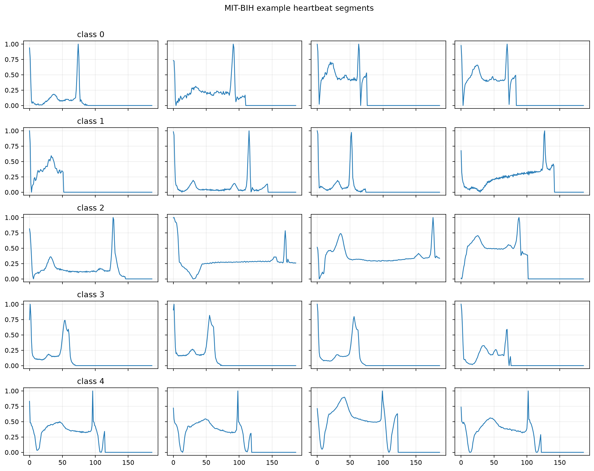
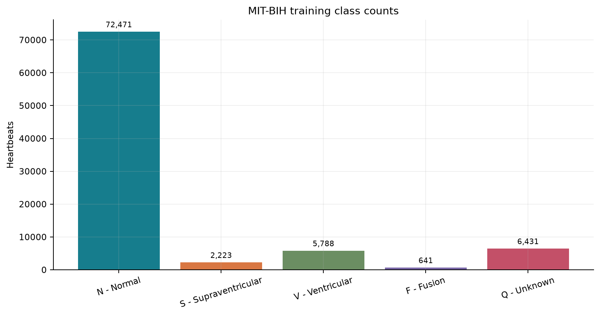
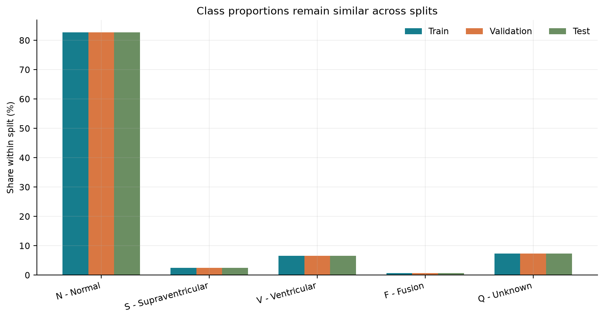
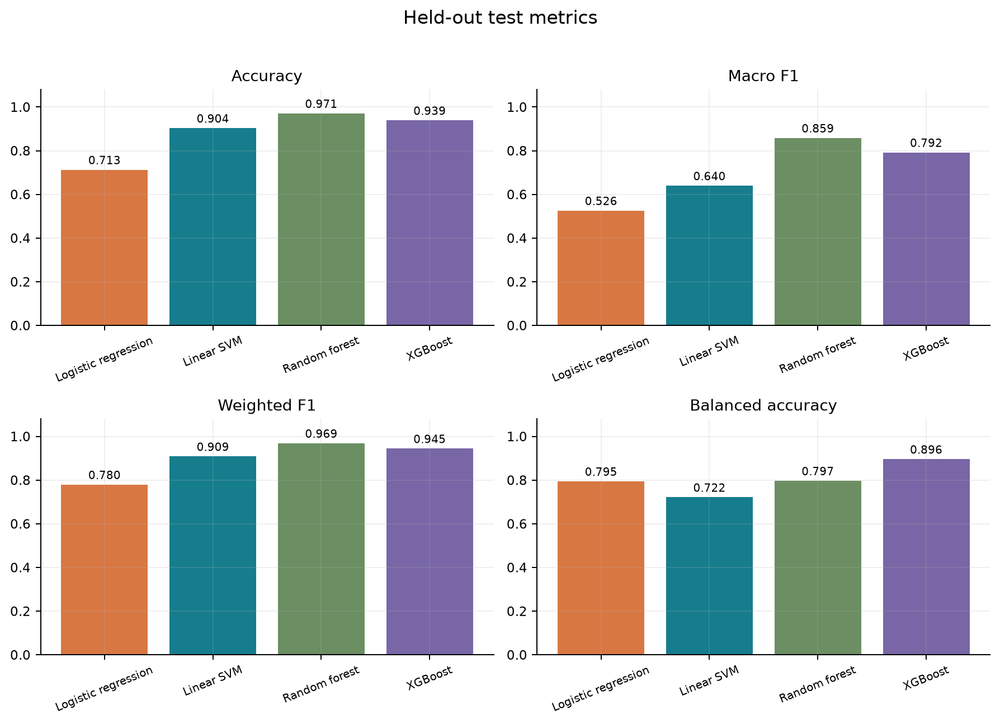

# ECG_Arrhythmia_Classification
ECG Arrhythmia Classification Using Signal Processing [Machine learning]

This project is a machine learning ECG Arrhythmia classification system built around signal processing and engineered waveform features. The goal is to detect whether a heartbeat is normal or arrhythmic and, when abnormal, classify it into one of the five MIT-BIH rhythm categories: N, S, V, F, and Q.

The project uses signal-processing-driven feature extraction combined with ML models, not deep learning. The workflow is designed to be interpretable, robust to class imbalance, and suitable for a serious ECG classification portfolio project.

## Project goal

This is a multiclass ECG classification task with a clinically meaningful framing:

- detect normal vs abnormal rhythm
- identify the specific arrhythmia category
- handle class imbalance using macro F1 and per-class evaluation
- evaluate the strongest ML model on a hold-out test set

## Dataset

Dataset: https://www.kaggle.com/datasets/shayanfazeli/heartbeat

This project uses the MIT-BIH heartbeat files:

- data/raw/mitbih_train.csv
- data/raw/mitbih_test.csv

The PTBDB files are excluded because they represent a different classification task and would dilute the MIT-BIH 5-class ECG problem.

The MIT-BIH files contain 188 columns per row: 187 ECG signal samples and one label column.

| Class | Label | Train | Validation | Test |
|---:|---|---:|---:|---:|
| 0 | N | 57,977 | 14,494 | 18,118 |
| 1 | S | 1,778 | 445 | 556 |
| 2 | V | 4,630 | 1,158 | 1,448 |
| 3 | F | 513 | 128 | 162 |
| 4 | Q | 5,145 | 1,286 | 1,608 |


### Beat and data preview

Each CSV row represents one fixed-length heartbeat: 187 waveform samples followed by a class label. The waveform values are scaled to the range `[0, 1]`; the label is one of the five MIT-BIH classes. The table shows the first five samples from the first training example found for each label. It is only a short excerpt; each beat has 187 sample values.

| Label | Class | Sample 0 | Sample 1 | Sample 2 | Sample 3 | Sample 4 |
|---:|---|---:|---:|---:|---:|---:|
| 0 | N — Normal | 0.97794 | 0.92647 | 0.68137 | 0.24510 | 0.15441 |
| 1 | S — Supraventricular | 1.00000 | 0.66667 | 0.10046 | 0.03653 | 0.07306 |
| 2 | V — Ventricular | 0.00000 | 0.00976 | 0.07439 | 0.16220 | 0.24024 |
| 3 | F — Fusion | 1.00000 | 0.89975 | 0.64160 | 0.31454 | 0.10150 |
| 4 | Q — Unknown | 0.71261 | 0.62903 | 0.52786 | 0.41496 | 0.28446 |







## Method

### Pipeline overview

1. Validate the raw ECG dataset
2. Split the MIT-BIH training set into train and validation stratified folds
3. Apply signal preprocessing and filtering
4. Extract waveform and spectral features
5. Train ML models using engineered features
6. Select the best model using validation macro F1
7. Evaluate the final model on the hold-out test set
8. Generate confusion matrices and per-class performance summaries

### Signal-processing feature pipeline

The feature extraction stage combines signal morphology, temporal behavior, and frequency-domain information:

- time-domain statistics: mean, std, min, max, range, quantiles, skew, kurtosis, energy, zero-crossing rate
- frequency-domain descriptors: FFT band power, spectral centroid, spectral rolloff, dominant frequency, spectral entropy
- waveform-shape descriptors: main peak position, peak height, prominence, width, autocorrelation patterns

These features are saved as:

- data/processed/features_train.npy
- data/processed/features_val.npy
- data/processed/features_test.npy

### ML models

The project is still under process and selecting models among:

- Logistic Regression
- Linear SVM
- Random Forest
- XGBoost

The selected final model is chosen using validation macro F1, which is the right metric for this strongly imbalanced ECG dataset.

## Verified benchmark result

The current ML benchmark shows the best model is Random Forest.

| Model | Test accuracy | Test macro F1 | Test weighted F1 |
|---|---:|---:|---:|
| Random Forest | 0.9712 | 0.8584 | 0.9691 |
| XGBoost | 0.9380 | 0.7902 | 0.9437 |
| Linear SVM | 0.9036 | 0.6400 | 0.9087 |
| Logistic Regression | 0.7136 | 0.5266 | 0.7801 |

This could be used for furthur upgradation in the models



## Main finding

We are testing our models continuously and soon get all the results and best model as well...

### Notebook guide

| Notebook | Contents |
|---|---|
| [01 EDA](notebooks/01_eda.ipynb) | Previews the raw files, checks shapes, labels, missing values and duplicate waveforms, explores class balance and waveform ranges, and creates exploratory plots. |
| [02 Signal and Features](notebooks/02_signal_and_features.ipynb) | Loads the processed splits, previews filtering, builds the engineered feature matrices, and checks the feature outputs. |
| [03 ML Model Training](notebooks/03_ml_model_training.ipynb) | Trains and compares the classical models, uses validation macro F1 for selection, and reviews test metrics and plots. |
| [04 Final Evaluation](notebooks/04_final_evaluation.ipynb) | Summarizes the final model-selection rule and the held-out test evaluation. |

The notebooks are for exploration and review. `run_project.sh` is the reproducible command-line path for running all pipeline stages.

## Project workflow

Create the virtual environment from the project root:

```bash
python3 -m venv .venv
source .venv/bin/activate
python -m pip install --upgrade pip
python -m pip install -r requirements.txt
```

Place the Kaggle CSV files in the raw directory:

- data/raw/mitbih_train.csv
- data/raw/mitbih_test.csv

 Run the complete project

`run_project.sh` is the one-command runner. It switches to the repository root, activates the existing `.venv`, and stops as soon as a pipeline step fails. It does not install packages or download the dataset.

Before running, create the environment, install `requirements.txt`, and place `mitbih_train.csv` and `mitbih_test.csv` in `data/raw/`. Then run:

```bash
./run_project.sh
```

The runner performs these steps in order:

1. Validate the raw data files and label structure.
2. Create the stratified training and validation split.
3. Filter the beats and build the feature matrices.
4. Train and compare Logistic Regression, Linear SVM, Random Forest, and XGBoost.
5. Run split and shuffled-label sanity checks.
6. Write the final metrics, tables, plots, and confusion matrices.

## Project structure

```text
ecg-classification-signal-processing-ml/
├── data/
│   ├── raw/
│   ├── processed/
│   └── external/
├── models/
│   ├── checkpoints/
│   └── metrics/
├── notebooks/
├── reports/
│   ├── figures/
│   └── tables/
├── src/
│   ├── config.py
│   ├── data/
│   │   ├── load_data.py
│   │   ├── split_data.py
│   │   └── validate_data.py
│   ├── features/
│   │   ├── extract_features.py
│   │   └── signal_processing.py
│   ├── models/
│   │   ├── classical.py
│   │   ├── evaluate.py
│   │   ├── final_report.py
│   │   └── sanity_checks.py
│   ├── evaluation/
│   │   └── sanity_checks.py
│   ├── reporting/
│   │   └── final_report.py
│   ├── pipeline/
│   │   └── run_training.py
│   └── visualization/
│       ├── eda_plots.py
│       └── result_plots.py
├── requirements.txt
├── README.md
└── LICENSE
```

## Advanced improvement path

This project is already a strong ML foundation. The next advanced refinements are focused and appropriate:

- patient-aware splitting for more reliable generalization
- Fourier and spectral feature expansion
- better class-balancing and threshold tuning
- stronger per-class error analysis
- deployment-ready evaluation workflow

The important point is that the project remains ML-first, interpretable, and grounded in signal processing rather than deep learning.


